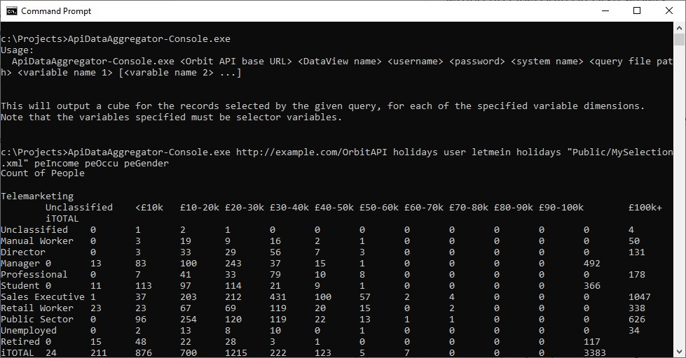

# ApiDataAggregator
This is a very simple application that connects to the Apteco API and given the path to a saved selection file and
some variable names will allow you to view some aggregations from a running 
[Apteco FastStats®](https://www.apteco.com/products/faststats) system.

### Background
Apteco FastStats® is part of the [Apteco Marketing Suite](http://www.apteco.com).  It provides a unique
combination of speed and power for data exploration, data mining analysis and customer understanding.

The Apteco API provides programmatic access to information held in an Apteco FastStats® database, as
well as reporting information generated from [Apteco PeopleStage™](https://www.apteco.com/products/peoplestage),
the powerful multi channel campaign automation software.

The ApiSystemAggregator is a sample application that connects to a Apteco FastStats® system via the
Apteco API to demonstrate how some simple system aggregations can be gathered.

### Usage
To use the ApiDataAggregator, download the latest release from [GitHub](https://github.com/Apteco/ApiDataAggregator/releases)
or build the software via Visual Studio or the .Net Core CLI (see [below](#Build)).

To find out what command line parameters are required, run the console application with no parameters:


You will need various pieces of information:

* The name of a DataView to connect to and a valid username and password for that DataView
* The name of a FastStats system inside that DataView to analyse.
* The path to a saved selection created with [Apteco FastStats®](https://www.apteco.com/products/faststats).
This selection must be saved in your public or private directory.
* A list of variable references to create an aggregated "cube" with.



### What the API Data Aggregator does

When you use the API Data Aggregator to return a set of rows for a saved selection file the API Data Aggregator runs
through the following steps:

1. Logs in to the API at the specified URL
2. Gets the definition of a saved query from the `/{dataViewName}/Queries/{systemName}/GetFileSync` endpoint.
3. Checks the given variable names are all selector variables, as these can be added to cubes without further
processing.  Other variable types can be added as cube dimensions, but require bandings or other types of cubes.
4. Creates a set of cube dimensions from the given variables and a single count measure (although cubes can process
multiple measures if they are specified).
5. Submits a cube request with the given query and list of dimensions and measurse.  The endpoint used is
`/{dataViewName}/Cubes/{systemName}/CalculateSync` 
6. Formats the resulting n-dimensional cube as a series of 2-dimensional tables and outputs them to the console.

### Implementation
* To see how the ApiClient code was generated from the API's Swagger specification, look at the
Readme in the [Apteco.ApiDataAggregator.ApiClient](Apteco.ApiDataAggregator.ApiClient) project.

* The [Apteco.ApiDataAggregator.Core](Apteco.ApiDataAggregator.Core) project contains the business logic for the
application (as described above).

* The [Apteco.ApiDataAggregator.Console](Apteco.ApiDataAggregator.Console) project contains a console application
entry point that simply gathers the command line parameters and starts the processing.

### Build
To build the project, either do so via Visual Studio (2017 or later) or using the dotnet CLI tool.

##### Visual Studio
Open the ApiDataAggregator.sln file in Visual Studio and build the project.

To generate the standalone executable, right-click on the Apteco.ApiDataAggregator.Console project and choose "Publish...".
Then choose the "Folder Profile" and publish that.  The binaries will be compiled into
`Apteco.ApiDataAggregator.Console\bin\Release\netcoreapp2.1\win-x64`

##### dotnet CLI
To build the project so that it will run under any archirecture that .Net Core supports (Windows, Mac OSX, Linux), go to the
root directory and run `dotnet build`.  This will compile the code so that it can be run using the commands:

```
cd Apteco.ApiDataAggregator.Console\bin\Debug\netcoreapp2.1
dotnet ApiDataAggregator-Console.dll
```

To build a .exe file that will run on the Windows 64 bit platform, go to the root directory and run 
```
dotnet publish -c Release -r win-x64
```

The binaries will be compiled into
`Apteco.ApiDataAggregator.Console\bin\Release\netcoreapp2.1\win-x64`
